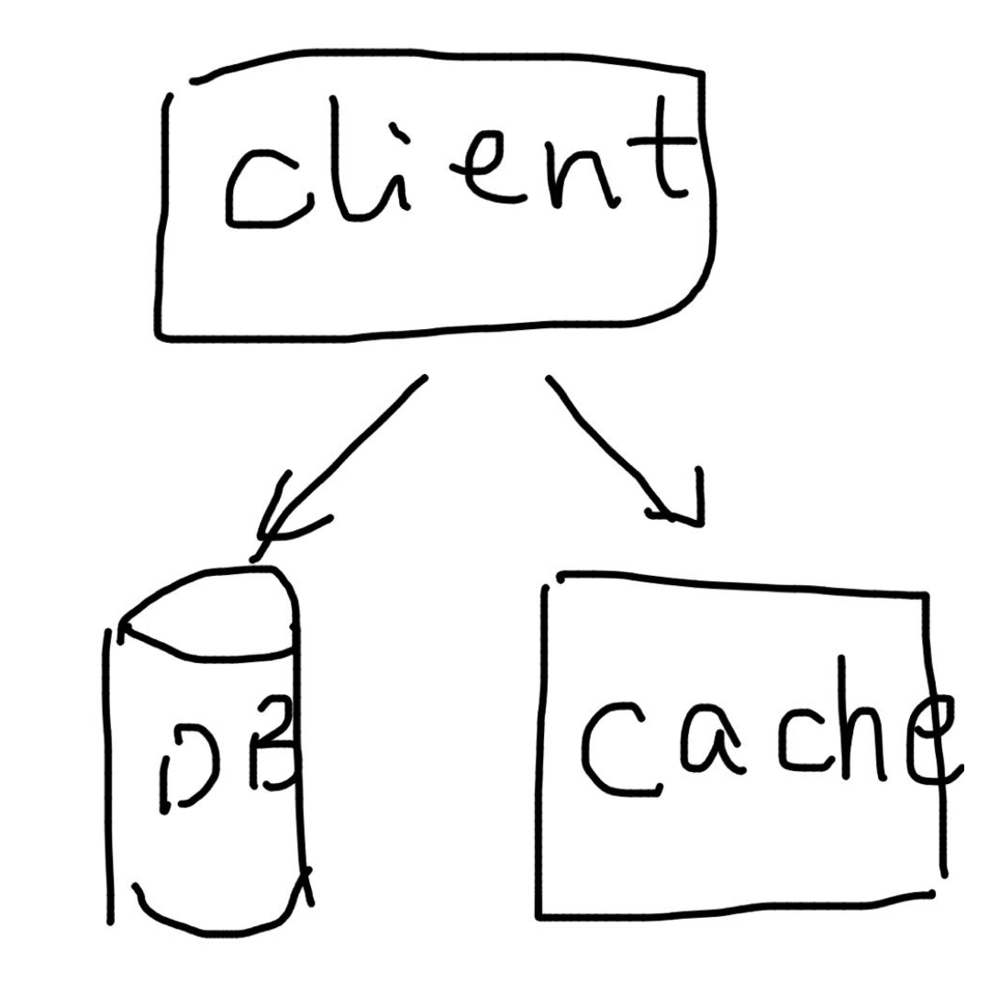

# 如何维持缓存的一致性

> 原文在 [这里](https://blog.the-pans.com/different-ways-of-caching-in-distributed-system/)

Phil Karlton 曾经说：“在计算机科学中只有两件难事：缓存失效以及命名。”这里还有一些对于这一论断的变形，我个人最喜欢的是 Jeff Atwood 的“计算机科学中有两件难事：缓存失效、命名以及大小差一错误  (off-by-one errors) 。”很明显，缓存是困难的。像分布式系统中的其他事情一样，你第一眼看上去这个问题可能不太难。我将会介绍几种分布式系统中的缓存方式，它将包含你会用到的大部分分布式系统。我会将重点放在如何维护缓存一致性上。

## 缓存 & 缓存一致性

在我们讨论缓存的不同方式前，我们需要明确一下 *缓存* 和 *缓存一致性* 的涵义，尤其是 *一致性* ，它是一个被严重复用的词语。

我们如此定义 *缓存* ：

> 一个存储部分底层数据物化视图的独立系统。

请注意，这是一个非常通用以及宽松的定义。它包含了你一般认为的缓存的含义，也就是存储和持久化的数据相同的值。它还包含了一些人们平时没有想到过的缓存的含义。比如分解的数据库的二级索引。在我们的定义中，这也可以是一种缓存，并且维护缓存的一致性非常重要。

如果符合以下条件，我们就说一个缓存是一致的：

> 如果缓存中存在一个键 `k` ，那么的值最终会和底层数据存储中存放的值相同。

根据这个定义，如果一个缓存，他没有存储任何数据，那么它一直都是一致的。

## 为什么使用缓存

一般来说，开发缓存是为了提升读写性能。这里的 *性能* 可以是延迟、吞吐量、资源利用率等。通常这些都是相关的。保护数据库通常也是一个非常重要的建立缓存的动机。不过你同样可以说它解决的是一个性能上的问题。

## 缓存的不同类型

### Look-aside / demand-fill 缓存

对于 look-aside 缓存来说，客户端在请求数据库之前请求缓存。如果命中了，就返回缓存中的值。如果没有命中，就要返回数据库中的值。就是这样。没有说如何向缓存中填入数据，只说了它应该如何被访问。但通常它使用的是 demand-fill 。demand-fill 指的是在缓存未命中的时候，客户端不仅从数据库中取数据，还会将取出来的数据放到缓存中。但这样做也不是必须的，比如可以让缓存和数据库 subscribe 同一个 log （比如说 Kafka），各自独立实现。这是一种非常合理的设置。但是在这个时候，缓存只是一个 look-aside 缓存而不是 demand-fill 的。并且在这种情况下，缓存中的数据可能比数据库中的数据更新。

很简单对吧？然而 **简单的 Look-aside / demand-fill 缓存会有永久不一致的问题！** 这个问题经常会由于 look-aside 缓存的简单性而被人们忽视。这个问题从根本上来说是因为在客户端向缓存中放入数据的时候，这个数据可能已经不在新鲜了。比如：

- 客户端缓存未命中
- 客户端从数据库中读到值 `A`
- 另外有人将数据库中的值修改为 `B` 并将缓存中的相应入口置为失效
- 客户端将值 `A` 放入了缓存

这个时候，客户端会从缓存中得到值 `A` 而不是最新的值 `B`。根据你的实际情况，这种现象可能是或者不是 OK 的。 这还由缓存的入口是否有 TTL 。但是你在使用 look-aside / demand-fill 缓存应该意识到这个问题。

**这个问题是可以被解决的。** 比如 Memcache 就是用了 `lease` 来解决这个问题。因为在本质上，这个问题是由于客户端没有保证读-修改-写安全性的原语而造成的，在这个语境下，“读”值得是从缓存中读，“修改”指从数据库中读，“写”是指写回缓存。一个简单的解决方法是在读缓存的时候持有一个“票据”，并在写的时候比较这个“票据”。这就是 Memcache 解决这个问题的方法。Memcache 将其称为 `lease` ，你可以将其看成是一个在每次缓存变化的时候都进行计数的计数器。所以在读取的时候，它会从 Memcache 主机上返回一个 `lease` ，在写入的时候，客户端将这个 `lease` 传回给主机。如果主机上的 `lease` 已经改变了， Memcache 将会使这次的写操作失败。现在让我们回到我们刚刚的那个例子：

- 客户端读取缓存未命中，并获得了一个 `lease` `L0`
- 客户端从数据库中读到了一个值 `A`
- 另外有人将数据库中的值修改为 `B` 并将缓存中的相应入口置为失效，并将 `lease` 改成了 `L1`
- 客户端将 `A` 写入缓存，但是由于 `lease` 不匹配导致了写入失败

这个时候缓存就一致啦 :)
