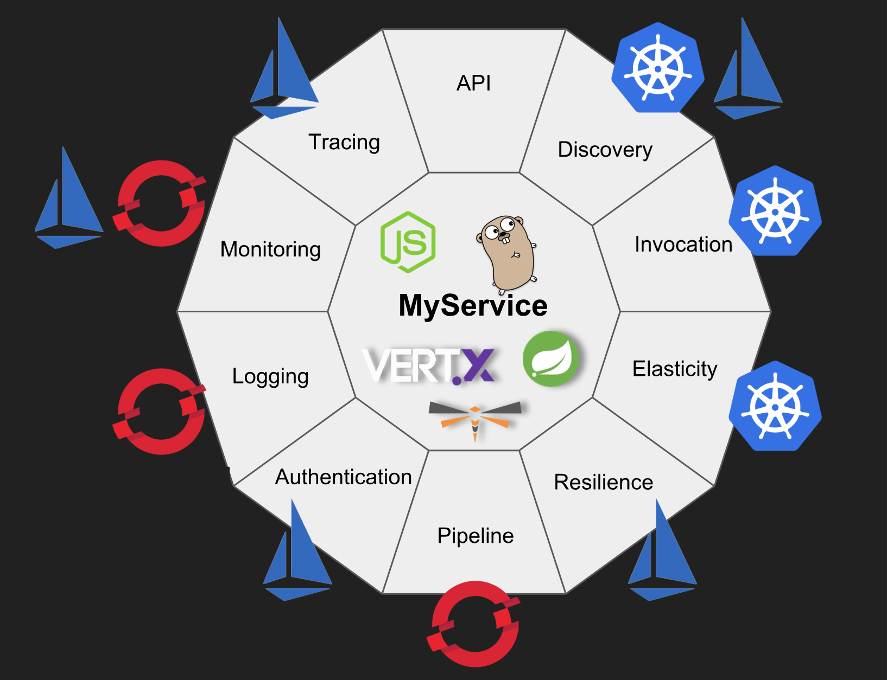

# 为什么 Kubernetes 是新的应用服务器

[原文链接](https://developers.redhat.com/blog/2018/06/28/why-kubernetes-is-the-new-application-server/)

你想过你为什么要使用容器来部署你的多平台应用吗？只是为了赶时髦吗？在这篇文章中，我将通过几个尖锐的问题来表明我对“为什么 Kubernetes 是新的应用服务器”的看法。

你可能发现了，大部分语言是通过解释和 runtime 来执行你的代码的。理论上，Node.js 、 Python 和 Ruby 的代码都可以很容易的从一个平台（ Window/Linux/MacOs ）移植到另一个平台。Java 应用走的更远，将编译后的 Java 类转化为字节码，能够在任何有JVM（Java Virtual Machine ）的地方运行。

Java 生态系统提供了一个标准的格式来发布同一个应用的所有 Java 类，你可以讲这些类打包为一个 JAR （ Java Archive ）， WAR （ Web Archive ）或者一个包含了前端、后端以及库的 EAR （ Enterprise Archive ）。所以我问你：为什么你还要用容器来发布你的 Java 应用呢？Java 应用不是已经可以很容易的在多种环境中移植了吗？

从开发者的角度来看这个问题的话，它的答案并不那么一目了然。但是，仔细思考一下你的开发环境和生产环境的不同，从而可能导致的问题：

* 你用的是 Mac ， Windows 还是 Linux ？你遇到过关于路径分隔符 `\` 和 `/` 的问题吗？
* 你用的是哪个版本的 JDK ？是不是你在开发的时候使用了 Java 10 ，而生产环境中使用的是 Java 8 ？你有没有遇到过由于 JVM 不同而导致的 bug ？
* 在产品部署的时候，你有没有遭遇过在开发环境中没有遇到过的 JDBC driver 和数据库服务器版本不同的问题？
* 你有没有过让服务器管理员创建一个 Datasource 或者一个 JMS 队列，并且他还把单词拼错了？

以上所有这些问题都是由于你的应用以外的因素导致的问题。而容器最重要的一点就是你可以把所有的东西（比如说一种分发版本的 Linux 、 JVM 、 应用服务器 、库、配置然后还有你的应用）都部署在一个预先构建好的容器中。并且，运行一个单一的、把所有东西都构建好了的容器绝对比你把你的代码移动到生产环境然后在出现故障的时候试着解决所有问题要简单的多。它不仅简单易执行，还能很容易的得到一个容器镜像的多份复制。

## 强化你的应用

在容器开始流行以前，几个 NFR （ non-functional requirements ）比如说安全、隔离、错误容忍、配置等功能都是由应用服务器（ Application Server ）提供的。可以类比一下，应用服务器的对于应用的作用就相当于 CD 播放器对于 CD 的作用。

作为一名开发者，你应当遵守预先定义好的标准并且以一个特定的格式来分发你的应用，而在另一方面，应用服务器会“执行”你的应用，每个“品牌”应用服务器（自己注：比如 Tomcat 和 Jetty ）都会提供各种各样的附加功能。注意：在 Java 的世界中，应用服务器提供的企业功能（ Enterprise capabilities ）的标准最近已经移到了 Eclipse 基金会下。 Eclipse Enterprise for Java (EE4J) 的工作已经转移到了 Jakarta EE。（更多信息请阅读[这篇文章](https://developers.redhat.com/blog/2018/04/24/jakarta-ee-is-officially-out/)或者[这个视频](https://developers.redhat.com/videos/youtube/f2EwhTUmeOI/)）

还是用前面 CD 播放器的类比，随着容器的流行，容器镜像已经成为了一种新的 CD 格式。事实上，容器镜像只是一个发布你的容器的格式。（如果你想更深入的了解什么是容器镜像以及它们如何分发可以看[这篇文章](https://developers.redhat.com/blog/2018/02/22/container-terminology-practical-introduction/)）

容器的真正的好处体现在你需要为你的应用增加企业功能的时候。为一个容器化的应用提供这些功能的最好办法是使用 Kubernetes 作为它们的平台。另外， Kubernetes 平台为其他项目比如  Red Hat OpenShift, Istio, 以及 Apache OpenWhisk 提供了良好的基础，并让构建和部署鲁棒的产品和高质量的应用变得更加简单。

下面我们来探索这九种功能：

### 1 - 服务发现

服务发现是一个找到如何连接到一个服务的过程。为了得到容器和原生云应用的种种好处，你需要将配置移出你的容器镜像从而让你能够在所有的环境中使用同一个镜像。从应用中外化配置是 [12-factor application](https://developers.redhat.com/blog/2017/06/22/12-factors-to-cloud-success/) 中的一项重要原则。服务发现是从运行时环境而不是应用中的硬编码中获得配置信息的一种方法。 Kubernetes 提供了开箱即用的服务发现功能。 Kubernetes 还提供了 ConfigMap 以及 Secrets 来从你的应用程序容器中移出你的配置。 Secrets 解决了一些存储连接到运行时服务的认证信息（比如数据库）的问题提出的挑战。

使用 Kubernetes 就不需要在使用外部的服务以及框架。你可以通过 Kubernetes YAML 文件管理每一个运行时环境的环境配置，也可以使用 Red Hat OpenShift 提供的 GUI 和 CLI 来让 DevOps 团队更容易地管理。

### 2 - 基本调用

运行在容器内部的应用程序可以通过 Ingress 来访问，换句话说，就是讲外部的请求路由到你暴露的服务。 OpenShift 使用有几种功能以及负载均衡策略的 HAProxy 提供了 *路由对象（ routing object）*。你可以使用路由功能来进行滚动部署。这可以作为一些复杂 CI/CD 策略的基础，详见下面的第六个功能的介绍。

那么你需要运行一个一次性的任务，比如说批处理或者简单的利用集群来计算一个结果（比如计算圆周率）的时候会怎么样呢？ Kubernetes 提供了 *任务对象（ job object ）* 来处理这种情况。同时还有 *Cron Job* 来管理一些基于时间的任务。

### 3 - 弹性

Kubernetes 使用 ReplicaSets （曾经被称作副本控制器）来解决弹性的问题。和 Kubernetes 的大部分配置相同，一个 ReplicaSets 是一种保持状态一致的方法：你告诉 Kubernetes 系统应该处于什么状态，然后 Kubernetes 会推算出如何达到这一状态。一个 ReplicaSets 在任何时候都控制着正在运行的应用的副本的数量。

但是当你构建的服务比你预计的更要受欢迎，而耗尽了算力的时候会怎么样呢？你可以使用可以根据监测的 CPU 利用率来扩展 pod 的 Kubernetes Horizontal Pod Autoscaler 。

### 4 - 日志

因为你的 Kubernetes 集群可以并且会运行几个你的容器化应用的副本，所以对日志进行聚合，并放在同一个地方进行展示就变得非常重要。另外，为了发挥如自动伸缩（或其他原生云功能）等优势，你的容器需要是不可变的。因此，你需要将日志存储在容器之外，这样它们才会在整个运行过程中保持持久性。

OpenShift 可以让你部署一个 EFK 栈来从主机和应用中聚合日志，他们可以来自多个容器甚至是已经删除的 pod 。

EFK 栈包括：

* Elasticsearch ，一个存储了所有日志的对象存储系统；
* Fluentd ，从节点中收集数据并将他们推入 ES ；
* Kibana ，一个 ES 的 Web UI 。

### 5 - 监控

虽然看起来日志和监控解决的同一个问题，但他们不同于彼此。监控包括了观察、检测、报警以及记录。而日志只负责记录。

Prometheus 是一个包含时序数据库的开源的监控系统。它可以用来存储和请求指标、报警并使用可视化来获得你的系统的内部信息。 Prometheus 可能是监控 Kubernetes 集群最受欢迎的选择。在 [Red Hat 开发者博客](https://developers.redhat.com/blog/)上有几篇文章讲到了使用 Prometheus 进行监控。你也可以在 [OpenShift 博客](https://blog.openshift.com/tag/prometheus/)上找到相关的文章。

### 6 - 构建以及部署流水线

CI/CD 流水线对于你的应用来说并不是必须的，但是 CI/CD 常被称为是成功的软件开发以及 DevOps 实践的支柱。所有软件部署到生产环境上都应该使用 CI/CD 流水线。 Jez Humble 和 David Farley 在 [Continuous Delivery: Reliable Software Releases through Build, Test, and Deployment 这本书](https://www.amazon.com/dp/0321601912?tag=contindelive-20)中这样描述 CD ：“持续交付是产品或用户能够通过安全、快速的可持续化的方式获得种各样改变——包括新特性、配置变更、 bug 修复以及试验功能等——的能力。”

OpenShift 提供了开箱即用的 CI/CD 流水线作为“[部署策略](https://docs.openshift.com/container-platform/3.7/dev_guide/builds/build_strategies.html#pipeline-strategy-options)”。我两年前录制的这个[视频](https://www.youtube.com/watch?v=N8R3-eNVoEc)中包含了一个使用 Jenkins CI/CD 流水线来部署一个新的微服务的例子。

### 7 - 恢复

在 Kubernetes 提供了集群自恢复的选项的同时，它同样可以帮助应用程序通过它还可以通过提供支持复制卷的持久卷来帮助应用程序进行恢复。Kubernetes 的副本控制器/部署（ ReplicationControllers/deployments ）确保了集群中一直有确定数量的 pod 副本在线，它可以自动处理任何可能的节点失效。

错误容忍和恢复共同作为解决用户关心的可靠性和可用性的解决方式。可以通过 Istio 的重试规则、熔断器以及 pool ejection 来为运行在 Kubernetes 上的应用程序提供错误容忍的能力。你想亲眼看看吗？可以在 https://learn.openshift.com/servicemesh/7-circuit-breaker 上看看 Istio 断路器教程。

### 8 - 认证

Kubernetes 的认证也可以通过 Istio 的 mutual TLS authentication 提供。其目标是在不改变服务代码的基础上加强微服务的安全性以及通信。其责任是：

* 为每个服务提供一个强大的标识，以表示其在集群和云中实现互操作性的作用；
* 确保服务到服务的通信和终端用户到服务的通信；
* 提供一个重要的管理系统，使密钥和证书生成、分发、流转和撤销自动化。

另外，值得一提的是，你也可以通过运行 Kubernetes/OpenShift 集群中的 Keycloak 来提供认证以及授权功能。 Keycloak 是 Red Hat 单点登录的上游产品。更多信息参见 [Single-Sign On Made Easy with Keycloak](https://developers.redhat.com/blog/tag/keycloak/)。如果你是用 Spring Boot ，可以看这个视频： [Secure Spring Boot Microservices with Keycloak or read the blog article](https://developers.redhat.com/videos/youtube/Bdg_DjuoX0A/)。

### 9 - 跟踪

使用 Istio 的应用可以被配置为使用 Zipkin 或者 Jaeger 收集追踪范围。Istio 可以进行分布式追踪，并且无视你的应用使用的语言、框架以及平台。参见 https://learn.openshift.com/servicemesh/3-monitoring-tracing 。以及 [Getting Started with Istio and Jaeger on your laptop](https://developers.redhat.com/blog/2018/05/08/getting-started-with-istio-and-jaeger-on-your-laptop/) 和 [Advanced microservices tracing with Jaeger](https://developers.redhat.com/blog/2018/06/20/next-devnation-live-advanced-microservices-tracing-with-jaeger-june-21st-12pm-edt/) 。

## 那么应用服务器就玩完了吗？

仔细看看这些功能，你会发现 Kubernetes + OpenShift + Istio 确实可以捕鼠器你的应用，并且提供应用服务器以及向 Netflix OSS 这样的框架所能提供的特性，那么这就代表应用服务器应玩完了吗？

在这个新的容器时代，应用容器开始转变为类似于框架的存在。软件开发的演化自然导致了应用服务器的演化，这种演进的一个很好的例子是 Eclipse MicroProfile 规范，它将 WildFly Swarm 作为应用程序服务器，它提供了诸如容错、配置、跟踪、REST（客户端和服务器）等开发人员的特性。然而，他俩都被设计的非常轻量化，WildFly Swarm 没有完整的 Java enterprise 应用服务器所需要的一大串组件，它更专注于微服务并只包含足够应用服务器构建所用的组件，让你像运行一个 .jar 文件一样运行你的应用。可以通过[这篇博客](https://developers.redhat.com/blog/tag/microprofile/)阅读更多关于 MicroProfile 的内容。

此外， Java 应用还可以获得诸如 Servlet 引擎、 datasource pool 、依赖注入、事务、消息传递等特性。当然，框架就可以提供这些特性，但是一个应用服务器同时还在任意一种环境中包含所有的你用来进行构建、运行、部署以及管理的企业级应用所用到的东西，不管他们是否在容器中。事实上，应用服务器可以在任何地方执行，比如在裸金属（ Barematel ）上、在如 Red Hat Virtualization 的虚拟平台上、在如 Red Hat OpenStack 的云环境上以及如 Azure 和 AWS 这样的共有云环境上。

一个好的应用服务器确保提供的 API 和它们的实现之间的一致性。开发人员可以确保部署他们的需要特定功能的业务逻辑可以正常运行，因为因为应用程序服务器开发人员（以及已定义的标准）确保了这些组件协同工作并一起发展。另外，一个好的应用服务器也应当最大化吞吐量和可伸缩性，因为它将会处理所有的用户请求；也应当具有低延时、低加载时间，因为它可以让你的应用更加可用；还需要封装的更加轻量，来最小化硬件资源的开销；最后，还需要足够的安全性来抵抗任何网络攻击。对于 Java 开发者来说， Red Hat 提供了 JBoss 平台，它是一个可以覆盖所有这些需求的、现代的、模块化的应用服务器。

## 结论

容器镜像已经成为了分发原生云应用的标准打包格式。虽然容器“本身”并不能为应用程序提供真正的业务优势，但是 Kubernetes 及其相关的项目，如 OpenShift 和 Istio ，提供了以前作为应用程序服务器一部分的非功能性需求。

大多数这些开发者们从应用服务器或者如 Netflix OSS 之类的库中得到的非功能的需求，都绑定了一种特定的语言，比如 Java 。另一方面，开发者们在选择 Kubernetes + OpenShift + Istio 来满足他们的需求的时候，他们并没有被束缚在任何一种特定的语言上，这就鼓励了在各种实际情况下使用最佳的技术/语言。

最后，应用服务器在软件开发中仍占有一席之地。但是他们在转变成为一种更像在开发应用的时候使用的特定语言的框架，因为它们包含了很多已经写好并经过测试的功能。

使用容器、 Kubernetes 和微服务的最大的好处之一就是你不需要再为你的服务选择一个单一的应用服务器、框架、架构风格甚至是语言。你可以很容易的部署一个带有运行着你的现有的 Java EE 应用的 JBoss EAP 的容器，并且部署其他容器有着新的使用 Wildfly Swarm 的微服务，或者响应式编程的 Eclipse Vert.x 。所有这些容器都可以通过 Kubernetes 进行管理。如果要实际看看这些概念，可以看看 [Red Hat OpenShift Application Runtimes](https://developers.redhat.com/products/rhoar/overview/) 。使用 LAUNCH 服务来构建和部署一个使用 WildFly Swarm/Vert.x/Spring Boot/Node.js 的在线 app 。选择 Externalized Configuration mission 来学习如何使用 Kubernetes ConfigMaps 。这将开启你的原生云应用之路。

你可以说 Kubernetes/OpenShift 是新的 Linux 甚至“ Kubernetes 是新的应用服务器”。但是事实是应用服务器/runtime + OpenShift/Kubernetes + Istio 已经成为了事实上的原生云应用平台！
